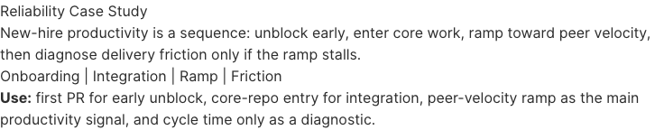

# New-Hire Productivity Dashboard

Live dashboard:
`https://nicholas-chapman-95.github.io/new-hire-productivity-dashboard/`

Full source repo:
`https://github.com/Nicholas-Chapman-95/new-hire-productivity-case-study`



This project is a compact analytics case study on new-hire productivity in software engineering teams. It asks two practical questions:

- How quickly do new hires reach a first meaningful contribution?
- How quickly do they catch up to the normal pace of their local team environment?

The dashboard is designed for decision-making rather than model complexity. It narrows the story to two operating reads:

- `Setup`: `% with first PR by day 30`
- `Ramp`: `% at local benchmark by day 90`

## Which Repo To Open

- Open this repo if you want the live dashboard and the shortest possible review path.
- Open `new-hire-productivity-case-study` if you want the full source work: dbt models, DuckDB snapshot, dashboard source, and supporting investigation material.

## What This Shows

The dashboard argues that onboarding performance is easier to manage when `setup` and `ramp` are separated.

- `Setup` is about early unblocking: access, environment readiness, first-task design, and review-path friction.
- `Ramp` is about whether a new hire catches up to the normal pace for their local team context after that first contribution.
- Supporting appendix pages preserve rejected ideas, diagnostic checks, and follow-up data we would want next.

If you want to inspect the modeling and transformation work behind the dashboard, the separate source repo includes the dbt project, DuckDB snapshot, and dashboard source.

## Suggested Reading Path

If you are opening this as a hiring manager or reviewer, the shortest path is:

1. `Status Quo`
2. `Metric Validity`
3. `Proposed > Setup`
4. `Proposed > Ramp`
5. `Recommendations`

## Repo Contents

- `pages/`: dashboard content
- `queries/`: Evidence SQL queries used by the pages
- `sources/`: datasource definitions against the shipped DuckDB snapshot
- `data/productivity.duckdb`: portable data snapshot used for the public build

## Local Development

If you want to run the dashboard locally:

```bash
nvm use
npm ci
npm run sources
npm run dev
```

The app runs on `http://localhost:3000`.

## Tech Stack

- [Evidence](https://docs.evidence.dev/) for the analytics UI
- DuckDB for the shipped analytical snapshot
- GitHub Pages for hosting
